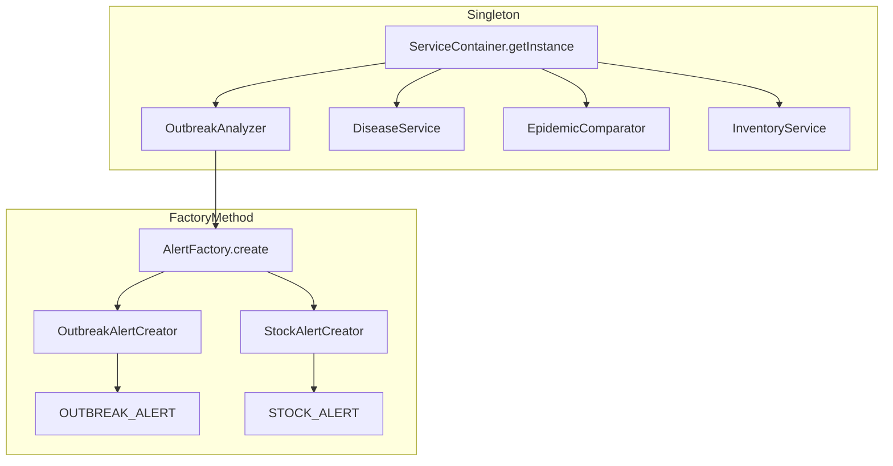

# Patrones de Diseño en VetCore

Este documento describe los patrones de diseño implementados en el proyecto, con referencias al código fuente.

---

## 1. Singleton

### Definición

Garantiza que una clase tenga **una única instancia** y proporciona un punto de acceso global a ella.

### Implementación en Backend: `ServiceContainer`

**Archivo:** `CORE/patterns/service-container.singleton.js`

```javascript
class ServiceContainer {
    static #instance = null;

    constructor() {
        if (ServiceContainer.#instance) {
            return ServiceContainer.#instance;
        }
        // ... cableado de dependencias ...
        ServiceContainer.#instance = this;
    }

    static getInstance() {
        if (!ServiceContainer.#instance) {
            ServiceContainer.#instance = new ServiceContainer();
        }
        return ServiceContainer.#instance;
    }
}
```

**¿Por qué aquí?**
- Los servicios CORE (`OutbreakAnalyzer`, `DiseaseService`, etc.) deben existir **una sola vez** en el proceso Node.js
- Evita instancias duplicadas con estado inconsistente
- Centraliza el cableado de dependencias (DIP)

**Uso:**

```javascript
const ServiceContainer = require('./patterns/service-container.singleton');
const container = ServiceContainer.getInstance();
container.services.outbreakAnalyzer.analyzeDisease(diseaseId);
```

**Punto de entrada:** `CORE/index.js` obtiene la instancia única y exporta los servicios.

### Implementación en Frontend: Angular DI

**Archivos:** `FRONTEND/src/app/core/*.service.ts`

Angular implementa Singleton de forma nativa con `@Injectable({ providedIn: 'root' })`:

```typescript
@Injectable({ providedIn: 'root' })
export class DiagnosisService { /* ... */ }

@Injectable({ providedIn: 'root' })
export class ApiService { /* ... */ }

@Injectable({ providedIn: 'root' })
export class AuthService { /* ... */ }
```

Angular crea **una sola instancia** por servicio en toda la aplicación. Todos los componentes que inyectan `DiagnosisService` comparten la misma instancia.

| Servicio | Responsabilidad Singleton |
|----------|--------------------------|
| `AuthService` | Sesión y token únicos en toda la app |
| `ApiService` | Cliente HTTP centralizado |
| `DiagnosisService` | Lógica de diagnósticos/epidemiología |

---

## 2. Factory Method

### Definición

Define una interfaz para crear objetos, pero delega a las **subclases** la decisión de qué clase instanciar. Encapsula la lógica de creación.

### Implementación: `AlertFactory`

**Archivo:** `CORE/patterns/alert.factory.js`

```
                    AlertFactory.create(type, context)
                              │
              ┌───────────────┴───────────────┐
              ▼                               ▼
    OutbreakAlertCreator              StockAlertCreator
    createAlert(context)              createAlert(context)
              │                               │
              ▼                               ▼
    { type: 'OUTBREAK_ALERT', ... }   { type: 'STOCK_ALERT', ... }
```

**Estructura:**

```javascript
// Clase base (Factory Method)
class AlertCreator {
    createAlert(_context) {
        throw new Error('createAlert() debe ser implementado por la subclase');
    }
}

// Productos concretos
class OutbreakAlertCreator extends AlertCreator { /* ... */ }
class StockAlertCreator extends AlertCreator { /* ... */ }

// Factory
class AlertFactory {
    static create(type, context) {
        const creator = AlertFactory.#creators[type];
        return creator.createAlert(context);
    }
}
```

**¿Por qué aquí?**
- Las alertas tienen estructuras similares pero lógica de construcción distinta
- `OutbreakAnalyzer` no necesita conocer cómo se construye cada tipo de alerta (SRP + OCP)
- Agregar un nuevo tipo (`VACCINATION`, `QUARANTINE`) solo requiere un nuevo `Creator`

**Uso en producción:**

```javascript
// CORE/epidemiology/outbreak.analyzer.js
if (isOutbreak) {
    result.alert = AlertFactory.create('OUTBREAK', {
        disease,
        caseCount,
        threshold: effectiveThreshold,
        medicationAvailabilities
    });
}
```

**Extensibilidad (OCP):**

```javascript
class VaccinationAlertCreator extends AlertCreator {
    createAlert(context) { /* ... */ }
}

AlertFactory.registerCreator('VACCINATION', new VaccinationAlertCreator());
```

---

## 3. Repository Pattern (complementario)

Aunque no fue solicitado explícitamente, el proyecto ya usa el patrón **Repository** para separar acceso a datos de la lógica de negocio:

**Archivos:** `CORE/repositories/diagnosis.repository.js`, `disease.repository.js`, `inventory.repository.js`

Esto refuerza **SRP** y **DIP**: los servicios CORE dependen de repositorios, no de Mongoose directamente.

---

## Diagrama de relaciones



---

## Archivos del proyecto

| Patrón | Archivo |
|--------|---------|
| Singleton (Backend) | `CORE/patterns/service-container.singleton.js` |
| Singleton (Frontend) | `FRONTEND/src/app/core/diagnosis.service.ts` |
| Singleton (Frontend) | `FRONTEND/src/app/core/api.service.ts` |
| Singleton (Frontend) | `FRONTEND/src/app/core/auth.service.ts` |
| Factory Method | `CORE/patterns/alert.factory.js` |
| Uso Factory Method | `CORE/epidemiology/outbreak.analyzer.js` |
| Punto de entrada | `CORE/index.js` |

---

## Referencias

- [SOLID_PRINCIPLES.md](./SOLID_PRINCIPLES.md) — Principios SOLID aplicados
- [ARCHITECTURE.md](./ARCHITECTURE.md) — Arquitectura general del proyecto
